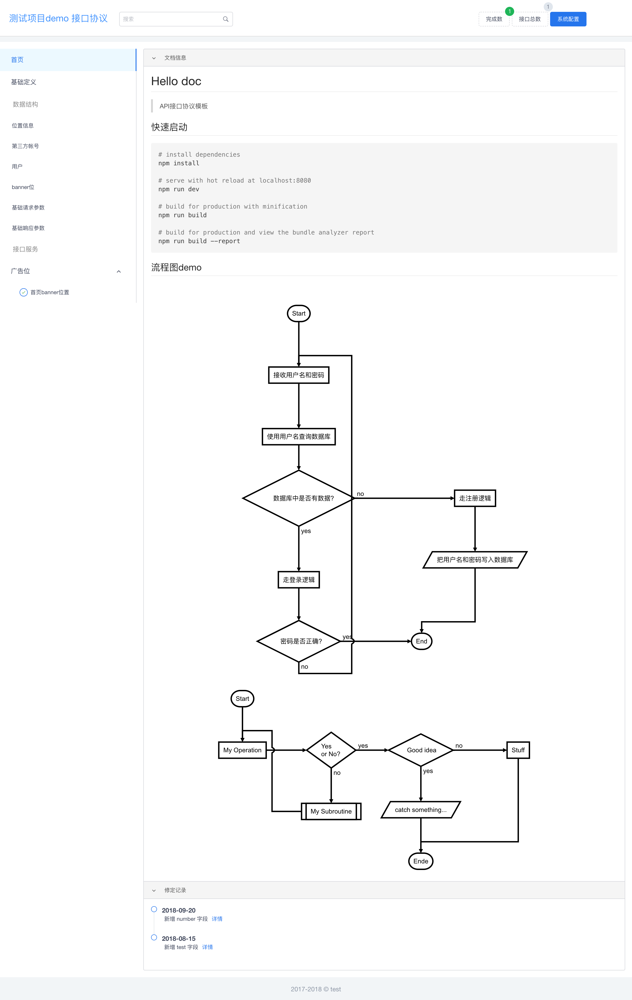

# Hello doc


> Hello doc是一款快译通通过代码生成漂亮的api在线文档工具，支持java快速生成接口文档

运行demo：~~demo~~


[TOC]


截图展示：





## 特性
* 支持markdown（包含flowchat流程图）
* 参数实体跳转
* java注解支持
* 菜单快速筛选
* 接口搜索
* 接口统计

## 待实现功能
- [ ] mock接口
- [ ] swagger配置文件转换为hello doc
- [ ] markdown功能增强时序图等功能
- [ ] 文档工具国际化支持
- [ ] 文档工具接入在线评论支持评论功能
- [ ] 文档导出为pdf和word格式


## 快速使用

### java插件集成

#### 1.设置pom

pom.xml文件的`plugins`下引入以下配置

```xml
 <plugin>
                <groupId>com.iflytek.cbg.hello</groupId>
                <artifactId>hello-docs-plugin</artifactId>
                <version>1.0-SNAPSHOT</version>
                <configuration>
                    <docDirectory>${project.basedir}/docs/api-docs</docDirectory>
                    <scanPackage>
                        <package>com.iflytek.cbg.emoji.api</package>
                        <package>com.iflytek.cbg.emoji.common.vo</package>
                    </scanPackage>
                    <appName>案例项目</appName>
                    <copyright>demo</copyright>
                    <headers>
                        
                        <header>
                            <name>X-Ca-Version</name>
                            <desc>接口版本号</desc>
                            <required>true</required>
                        </header>
                        <header>
                            <name>X-Ca-Api</name>
                            <desc>接口服务名</desc>
                            <required>true</required>
                        </header>
                        <header>
                            <name>X-Ca-Timestamp</name>
                            <desc>时间戳，单位毫秒</desc>
                            <required>true</required>
                        </header>                       
                        <header>
                            <name>Content-Type</name>
                            <desc>application/octet-stream</desc>
                            <remark>请求文本类型,二进制数据流</remark>
                            <required>true</required>
                        </header>
                        <header>
                            <name>X-Ca-Signature</name>
                            <remark>签名</remark>
                            <required>true</required>
                        </header>
                    </headers>
                    <resps>
                        <resp>
                            <name>code</name>
                            <desc>返回编码</desc>
                        </resp>
                        <resp>
                            <name>msg</name>
                            <desc>返回消息</desc>
                        </resp>
                    </resps>
                    <tips>
                        <tip>请求头必须加上application/json</tip>
                        <tip>数据格式:JSON</tip>
                    </tips>
                </configuration>
            </plugin>
```

#### 2. 配置解释
`scanPackage`为必填项，需要指定扫描接口的包名，其他均为非必填项目
`appName`为项目名称
`docDirectory` 如果接口有指定api文档，那么将markdown的文档需要放到这个配置项对应的目录
`headers`此项为基础约定的header参数
`resps`为统一返回数据格式
`tips`为

#### 3. java类添加注解

1. 在接口类中添加以下注解
```java
@ApiServiceDocs(cnName = "账号密码登录", methods = {"post"}, group = "用户模块", version = "1.0", doc = "userLogin", finish = 100)
@ApiInDTO(clazz = ApiLoginReq.class)
@ApiOutDTO(clazz = ApiLoginResp.class)
public class LoginApiService extends AbstractApiService<ApiLoginReq, ApiLoginResp> {

    @Override
    public ApiLoginResp service(ApiLoginReq apiLoginReq, ApiExtend apiExtend) throws ApiException {
       return null;
    }
}
```
@ApiServiceDocs为描述接口的信息
`@ApiInDTO`和`@ApiOutDTO`为请求和相应实体

2. 对象参数
`@ApiInDTO`响应实体:
```java
@Valid
public class ApiLoginReq extends ApiReq {

    @ApiBasicFiled(desc = "用户手机号", type = "String", required = true)
    private String account;

    @ApiBasicFiled(desc = "用户密码", type = "String", required = true,example = "e10adc3949ba59abbe56e057f20f883e")
    private String pwd;
}
```
通过对字段使用`@ApiBasicField`进行字段注解，描述参数信息

3. 全局返回码

`@ApiGlobalCode`标记返回码
```java
@ApiGlobalCode
public class ApiRetCodes {

    /**
     * 00xx - 成功
     */
    public static final ApiRet SUCCESS = new ApiRet("0000", "成功");

    /**
     * 9xxx - 异常
     */
    public static final ApiRet FAIL = new ApiRet("9999", "系统异常");
}
public class ApiRet implements Serializable {
    private String code;
    private String msg;
}
```

#### 4. java使用的注解

| 注解 | 描述 |
| ---- | ---- |
| ApiBasicFiled | 描述请求参数和响应参数的字段描述，需配合@ApiInDTO或@ApiOutDTO使用 |
| ApiCode       | 接口返回码，用于接口类使用，外层必须嵌套`ApiCodes`注解       |
| ApiCodes      | 接口返回码集合，用于接口类使用                               |
| ApiDTO        | 对象实体                                                     |
| ApiGlobalCode | 全局返回码，用于描述整个系统的返回码的类上 |
| ApiIn | 接口入参需要传入`In`数组，和`ApiInDTO`不能同时使用，同时使用优先使用`ApiInDTO` |
| In | 单个入参，描述参数的类型，描述等。 |
| ApiOut | 接口单个出参需要传入`Out`数组，和`ApiOutDTO`不能同时使用，同时使用优先使用`ApiOutDTO` |
| Out | 单个出参，描述参数的类型，描述等。 |
| ApiServiceDocs | 接口服务描述，描述接口地址，简介，mardown文档地址等信息 |
| ApiTimeline | 接口或实体更新日志,参数为`Timeline`数组 |
| Timeline | 描述更新日志 |

#### 

### 运行插件

在项目目录下执行命令`mvn clean compile hello-docs:doc`

执行完成后在`target/api-doc`目录下生成了html，打开即可。


## 运行本项目

### 启动前端功能

``` bash
# install dependencies
npm install

# serve with hot reload at localhost:8080
npm run dev

# build for production with minification
npm run build

# build for production and view the bundle analyzer report
npm run build --report
```

### 安装java-plugin
1. 执行java-plugins下的`build-html.sh`脚本打包前端工程至插件的resource目录下

2. 执行mvn install 安装所有依赖.

### 执行java-plugin

在具体项目上直接使用`mvn hello-docs:doc`